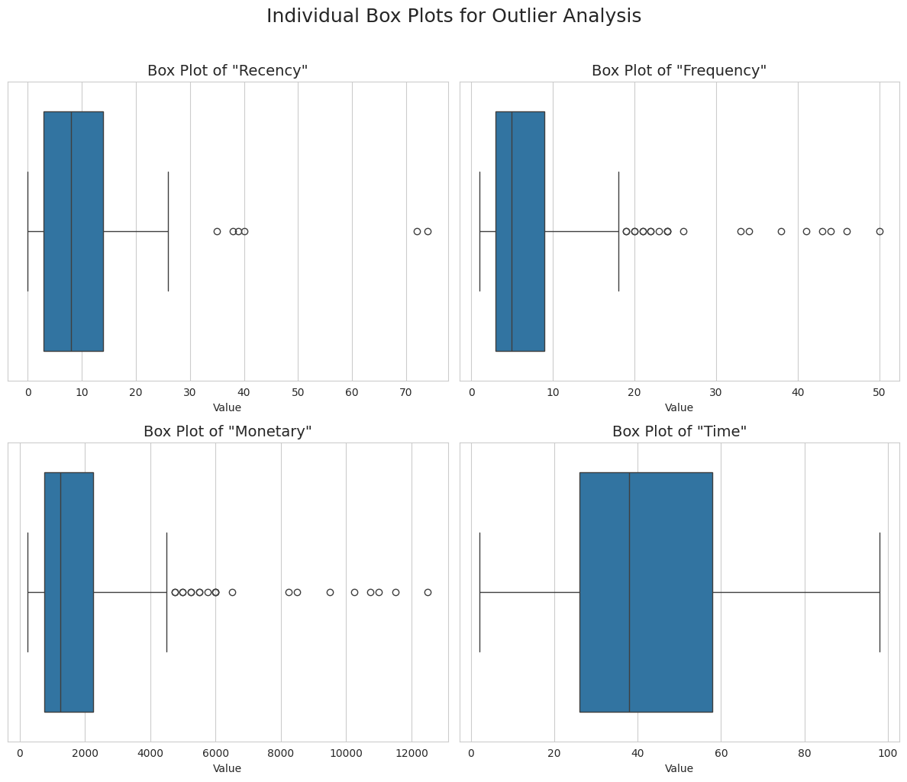
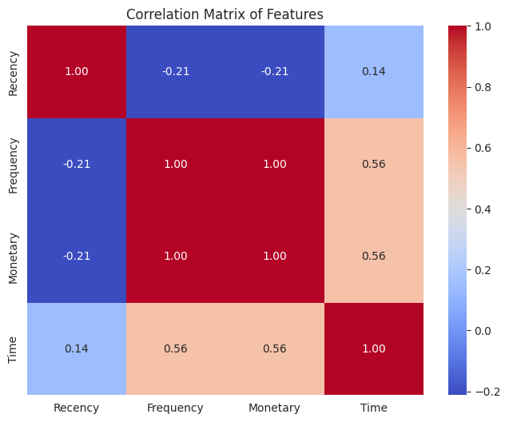
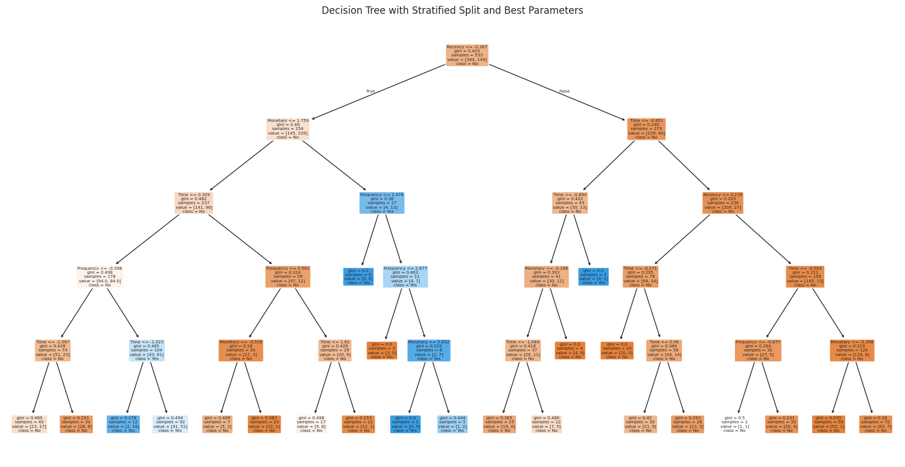

<div align="center">

#  Blood Donation Prediction

### Binary Classification on RFMTC Donor Behavior Data

*Decision Tree · SMOTE · IQR Outlier Removal · GridSearchCV · Stratified K-Fold*

<br/>

[](https://python.org)
[](https://scikit-learn.org)
[](https://pandas.pydata.org)
[](LICENSE)
[](https://archive.ics.uci.edu/ml/datasets/Blood+Transfusion+Service+Center)

<br/>


</div>

---

## About the Project

Predicting whether a blood donor will donate again is a critical operational problem for transfusion centers — it directly impacts blood inventory planning and donor outreach efficiency.

Two core challenges make this a non-trivial classification task:

1. **Class imbalance** — donors who do NOT donate again significantly outnumber those who do, causing naive classifiers to be biased toward the majority class
2. **Outlier sensitivity** — donation frequency and volume features contain extreme values that distort decision boundaries

**This project solves both: a full ML pipeline with IQR-based outlier removal, SMOTE oversampling, and GridSearchCV-tuned Decision Tree — with four model variants compared side by side to understand the impact of each technique.**

---

## Pipeline

This project follows a **load → clean → EDA → preprocess → model → tune** paradigm with six key stages:

### 1.  Data Loading & Initial Analysis
- Loaded `transfusion.data` from the UCI RFMTC Blood Transfusion dataset
- Assigned correct column names: `Recency`, `Frequency`, `Monetary`, `Time`, `Don`
- Inspected shape, dtypes, and statistical summary with `.info()` and `.describe()`

### 2.  Data Cleaning
- Verified zero null values — dataset is complete
- Removed duplicate rows with `drop_duplicates()` to ensure no repeated samples skew training

### 3.  Exploratory Data Analysis (EDA)

Four visualizations were produced on the raw data before any preprocessing:

| Plot | Purpose |
|------|---------|
| **Count Plot** | Revealed class imbalance — majority class is non-donors |
| **Histograms** | Showed skewed, non-normal distributions in all 4 features |
| **Box Plots (2×2 grid)** | Identified heavy outliers in `Frequency`, `Monetary`, and `Time` |
| **Correlation Heatmap** | Confirmed strong correlation between `Frequency` and `Monetary` |

**Feature Distributions**


> All four features are right-skewed — `Recency` and `Frequency` peak at low values with a long tail. `Monetary` mirrors `Frequency` perfectly (250 c.c. per donation). `Time` is the only feature with a roughly bell-shaped spread, indicating donors have varied membership durations.

**Outlier Analysis**



> Box plots confirm significant outliers across all features — especially `Frequency` and `Monetary` where some donors have 50+ donations and 12,000+ c.c. donated. These extreme values were removed using the IQR method (only on the training set) to prevent them from distorting decision boundaries.

**Correlation Matrix**



> `Frequency` and `Monetary` show near-perfect correlation (1.00) — this is expected since each donation contributes exactly 250 c.c. `Recency` is negatively correlated with both, meaning donors who gave recently tend to have fewer total donations. `Time` has moderate positive correlation with `Frequency` — longer membership generally means more donations.

### 4.  Data Preprocessing

A careful preprocessing sequence was applied to **prevent data leakage** — every transformation was fit on training data only, then applied to test data:

```
Raw Data
   ↓
Train / Test Split (80/20, stratified)
   ↓
IQR Outlier Removal  ←  applied only on training set
   ↓
SMOTE Oversampling   ←  applied only on training set
   ↓
StandardScaler       ←  fit on train, transform on both
   ↓
Model Training
```

> **Why this order matters:** Applying SMOTE or scaling before the train-test split would leak synthetic/scaled information into the test set — making evaluation scores artificially optimistic and unreliable in production.

### 5.  Model Building — Four Decision Tree Variants

Four configurations of Decision Tree (CART, Gini criterion) were trained and evaluated:

| Variant | What changes | Why it matters |
|---------|-------------|----------------|
| **① Without SMOTE** | Raw class imbalance | Baseline — reveals how much imbalance hurts |
| **② With SMOTE** | Balanced training via synthetic samples | Better recall on minority class (actual donors) |
| **③ Stratified Split** | Class ratio preserved in train/test | More reliable evaluation setup |
| **④ Stratified + GridSearchCV** | Hyperparameter tuning via 5-fold CV | Best generalizing model |

### 6.  Hyperparameter Tuning

Grid Search with 5-Fold Stratified Cross-Validation over:

```python
param_grid = {
    'max_depth':          [3, 5, 7, None],
    'min_samples_split':  [2, 5, 10],
    'min_samples_leaf':   [1, 2, 4]
}
```

`max_depth` controls overfitting — unconstrained trees memorize training data. `min_samples_leaf` prevents the tree from creating leaf nodes with too few samples, improving generalization.

---

## Results

### Best Model — Decision Tree Visualization



> The final tuned tree splits first on `Recency` — donors who gave recently (Recency ≤ −0.367 in scaled form) are already more likely to donate again. Subsequent splits use `Monetary`, `Frequency`, and `Time` to further refine predictions. Orange nodes predict **No donation**, blue nodes predict **Yes donation**. Leaf node depth is controlled by GridSearchCV to avoid overfitting.

### Evaluation Metrics — What They Mean

| Metric | What it measures | Better when |
|--------|-----------------|-------------|
| **Accuracy** | % of all predictions correct | Higher ↑ |
| **Precision** | Of predicted donors, how many truly donated | Higher ↑ |
| **Recall** | Of actual donors, how many were correctly identified | Higher ↑ |
| **F1-Score** | Harmonic mean of Precision and Recall | Higher ↑ |

> In an imbalanced medical dataset, **Recall matters more than Accuracy**. A model that labels everyone as "non-donor" can achieve ~76% accuracy while completely failing to identify any real donor. SMOTE directly improves Recall on the minority class.

### Model Comparison

```
① Without SMOTE
   Accuracy: lower — biased toward majority (non-donors)
   Recall on donors: weak — misses many actual donors

② With SMOTE
   Accuracy: comparable
   Recall on donors: improved — SMOTE creates synthetic donor samples

③ Stratified Split
   Accuracy: more reliable estimate
   Evaluation: reflects true class distribution in test set

④ GridSearchCV (Best Model)
   Best CV Score: optimized via 5-fold cross-validation
   Best Params: tuned max_depth, min_samples_split, min_samples_leaf
```

---

## Training Details

| Parameter | Value |
|-----------|-------|
| Algorithm | Decision Tree (CART) |
| Criterion | Gini Impurity |
| Imbalance Fix | SMOTE (`random_state=42`) |
| Outlier Removal | IQR (1.5× fence, training set only) |
| Scaler | StandardScaler |
| Train/Test Split | 80% / 20% |
| Cross-Validation | 5-Fold Stratified |
| Tuning | GridSearchCV |

---

## Dataset

**RFMTC — Blood Transfusion Service Center**

A publicly available dataset from the Blood Transfusion Service Center in Hsin-Chu City, Taiwan. Models donor behavior using the RFMTC marketing framework adapted for blood donation.

| Detail | Value |
|--------|-------|
| Records | 748 donors |
| Features | 4 (Recency, Frequency, Monetary, Time) |
| Target | `Don` — donated in March 2007? (1 = Yes, 0 = No) |
| Class ratio | ~76% No, ~24% Yes (imbalanced) |
| Source | [UCI Machine Learning Repository](https://archive.ics.uci.edu/ml/datasets/Blood+Transfusion+Service+Center) |

### Feature Definitions

| Feature | Description |
|---------|-------------|
| `Recency` | Months since last donation |
| `Frequency` | Total number of past donations |
| `Monetary` | Total blood donated in c.c. |
| `Time` | Months since first donation |
| `Don`  | **Target** — 1 if donated in March 2007, else 0 |

---

## Project Structure

```
blood-donation-prediction/
│
├── docs/
│   ├── feature_distributions.png       ← EDA: histogram of all 4 features
│   ├── outlier_boxplots.png            ← EDA: IQR outlier analysis
│   ├── correlation_matrix.png          ← EDA: feature correlation heatmap
│   └── decision_tree_best_model.png    ← Results: best tuned decision tree
│
├── blood_donation_machine_learning.ipynb   ← full pipeline: EDA → preprocessing → modeling
├── transfusion.data                        ← UCI RFMTC dataset
└── README.md                               ← project documentation
```

---

## Setup & Usage

### 1. Clone and install

```bash
git clone https://github.com/Adhavan1801/Blood-donation-prediction.git
cd blood-donation-prediction

pip install pandas matplotlib seaborn scikit-learn imbalanced-learn
```

### 2. Run the notebook

```bash
jupyter notebook blood_donation_machine_learning.ipynb
```

Run all cells top to bottom — the notebook is structured as a sequential pipeline with section headers.

---

## Key Concepts Demonstrated

- ✅ **Data leakage prevention** — outlier removal and scaling fit only on training data
- ✅ **Class imbalance handling** — SMOTE applied after train-test split
- ✅ **Stratified splitting** — preserves class distribution for fair evaluation
- ✅ **Hyperparameter tuning** — GridSearchCV with 5-fold cross-validation
- ✅ **Multi-stage EDA** — histograms, box plots, and heatmap before preprocessing
- ✅ **Decision Tree visualization** — full tree plot with Gini scores and sample counts

---

## Environment

| Component | Version |
|-----------|---------|
| Python | 3.x |
| Scikit-Learn | Latest |
| Pandas | Latest |
| Imbalanced-Learn | Latest |
| Seaborn / Matplotlib | Latest |

---

## Author

**Adhavan U S** · Amrita School of Artificial Intelligence · Amrita Vishwa Vidyapeetham, Coimbatore

---

<div align="center">

*Built end-to-end — data cleaning, EDA, preprocessing, imbalance handling, modeling, and tuning*

</div>
